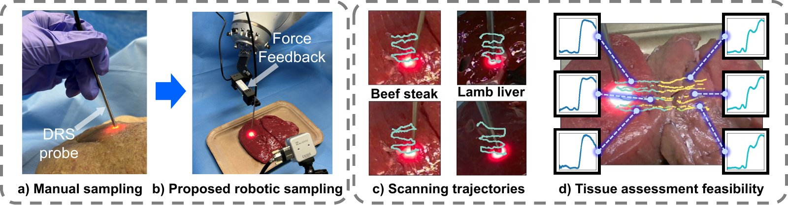

# Force-Regulated Robotic Diffuse Reflectance Spectroscopy Scanning

> 🚧 **Code coming soon.** This repository will host the code for our paper
> *"Force-Regulated Robotic Diffuse Reflectance Spectroscopy Scanning"* (submitted to the *Journal of Biomedical Optics*).
> The code will be released here after the manuscript is published.

**Kaizhong Deng, Zhangxi Zhou, Maxime Giot, Ioannis Gkouzionis, Christopher J. Peters, George P. Mylonas, Daniel S. Elson**
Hamlyn Centre for Robotic Surgery & Department of Surgery and Cancer, Imperial College London



## Overview

Diffuse reflectance spectroscopy (DRS) can tell malignant tissue apart from benign tissue during surgery. When a robot holds the probe, though, uncontrolled probe–tissue contact force distorts the spectra and can damage the tissue. We present an autonomous robotic DRS scanning system that controls contact force in real time, so large tissue areas can be scanned *ex vivo* safely and repeatably.

The system mounts a fibre-optic DRS probe and a load cell on a KUKA LBR iiwa14 arm and uses a third-person RealSense camera. It combines:

- **Image-based visual servoing (IBVS):** follows a raster scanning path defined in image space. It tracks the probe tip with a YOLO detector and the illuminated spot with a UNet/ResNet-34 segmenter, and cross-checks the two features to stay robust.
- **Contact force tracking:** uses load-cell feedback (120 Hz, median and moving-average filtering) to hold a target force of **0.08 N** and keep peaks below **0.3 N**.
- **Dynamic gating:** blends the visual servoing and force-tracking actions with a weight that depends on the force error.

**Key results** on *ex vivo* bovine and ovine tissue:

- Scan completion rates of 100% (bovine) and 93% (ovine), with no visible tissue damage. The system also ran 46 trials back to back over about 30 minutes without human intervention.
- Mean contact force of 0.079 N, matching an expert operator's 0.080 N, with lower variance and lower peak forces.
- Spectral consistency comparable to that of human operators (mean inter-observer spectral angle of 1.43°).
- 93.8% accuracy for SVM-based classification of tissue regions from the scanned spectra.

## Citation

If you find this work useful, please cite it. The BibTeX entry will be updated once the paper is published.

```bibtex
@article{deng2026forceregulated,
  title   = {Force-Regulated Robotic Diffuse Reflectance Spectroscopy Scanning},
  author  = {Deng, Kaizhong and Zhou, Zhangxi and Giot, Maxime and Gkouzionis, Ioannis and Peters, Christopher J. and Mylonas, George P. and Elson, Daniel S.},
  journal = {Journal of Biomedical Optics},
  year    = {2026},
  note    = {Accepted}
}
```

## Contact

For questions, please open an issue or contact the corresponding author, Prof. Daniel S. Elson (daniel.elson@imperial.ac.uk).

